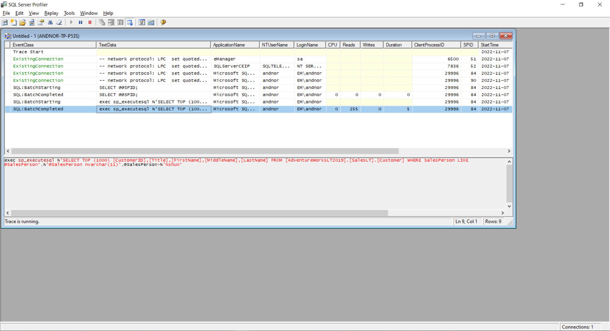
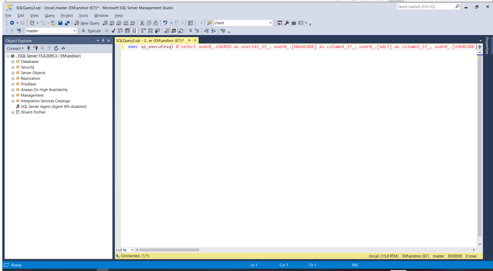
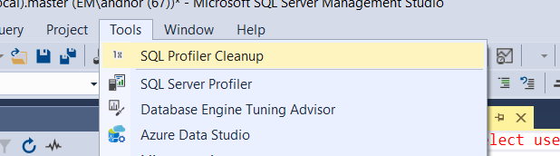
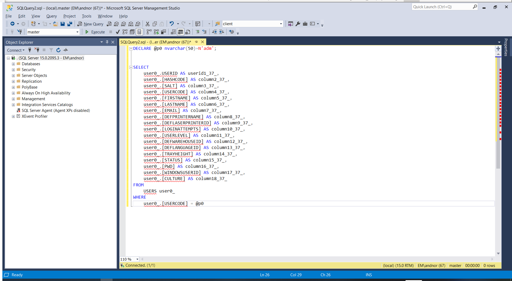

# SQL Profiler Cleanup

This creates a custom menu item for your Microsoft SQL Server Management Studio. The new command, found under **Tools -> SQL Profiler Cleanup** is a small utility that reformats the contents of your current window from dynamic SQL to regular SQL, making it easier to read and/or modify.

When using SQL Profiler, a typical output looks like this:

Copy the dynamic SQL and paste it into a new windon in SQL Server Management Studio:

Now, use the new **SQL Profiler Cleanup** menu item:

Result (which is much easier to work with):

## References

A good starting point for createing a SQL Server Management Studio plugin:  
[How to Create SQL Server Management Studio 18 (SSMS) Extension](https://www.codeproject.com/Articles/1377559/How-to-Create-SQL-Server-Management-Studio-18-SSMS)  
_Note:_ Make sure to read the comment about downgrading SDK to v15.0

A parser for dynamic SQL: [SqlProfilerQueryCleaner](https://github.com/mgroves/SqlProfilerQueryCleaner)

Some useful code: [SSMS Executor](https://github.com/devvcat/ssms-executor)
