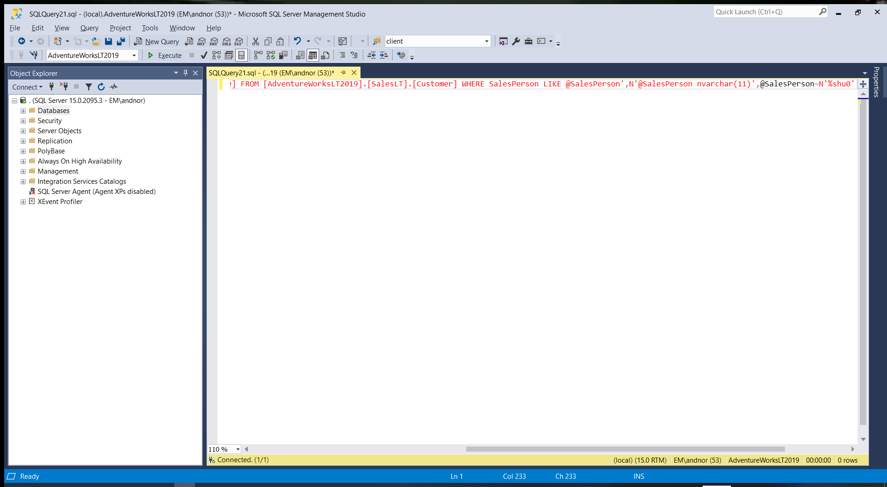

# SQL Profiler Cleanup

This creates a custom menu item for your Microsoft SQL Server Management Studio. The new command, found under **Tools -> SQL Profiler Cleanup** is a small utility that reformats the contents of your current window from dynamic SQL to regular SQL, making it easier to read and/or modify.

When using SQL Profiler, a typical output looks like this:

Copy the dynamic SQL and paste it into a new windon in SQL Server Management Studio:

Now, use the new **SQL Profiler Cleanup** menu item:

Result (which is much easier to work with):

